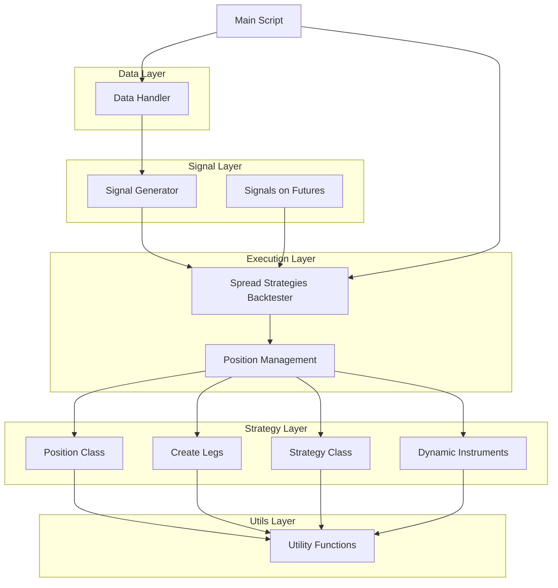

# Customized Backtesting Framework for Options
## Overview

This backtesting framework is designed to evaluate options trading strategies. It supports complex multi-leg strategies and allows the user to define custom instruments with actions. The framework is built to handle large datasets and can efficiently simulate trading scenarios over a specified period.
## Objectives

The primary objectives of this backtesting framework are:

1. **Accurate Simulation of Trading Strategies**:
    - Provide a robust platform to accurately simulate various trading strategies using historical market data.

2. **Performance Evaluation**:
    - Allow for detailed performance evaluation of trading strategies, including metrics like profit and loss (PnL), Sharpe ratio, drawdown, and other risk-adjusted return measures.

3. **Flexible Strategy Implementation**:
    - Offer flexibility to implement and test different trading strategies with ease, enabling users to customize parameters such as stop loss, target profit, and position sizing.

4. **Efficient Data Handling**:
    - Ensure efficient handling and processing of large volumes of market data, supporting parallel processing and multithreading to speed up backtesting computations.

5. **Dynamic Position Management**:
    - Incorporate advanced position management techniques, including dynamic adjustments to positions based on market conditions and real-time signals.

6. **Comprehensive Signal Generation**:
    - Support the generation of trading signals using various indicators and strategies, providing users with the ability to backtest these signals effectively.

7. **Risk Management**:
    - Integrate robust risk management features, including volatility-based position sizing, diversification with uncorrelated assets, and stop-loss mechanisms to protect against significant losses.

8. **User-Friendly Interface**:
    - Provide a user-friendly interface for setting up backtesting parameters, running simulations, and analyzing results. This includes clear documentation and examples.

9. **Scalability**:
    - Design the framework to be scalable, allowing it to handle a growing number of trading strategies and larger datasets without significant performance degradation.

10. **Extensibility**:
    - Ensure the framework is easily extensible, enabling users to add new strategies, indicators, and functionalities as needed without extensive modification to the core system.

11. **Robust Error Handling and Logging**:
    - Implement comprehensive error handling and logging mechanisms to ensure that any issues during backtesting are properly recorded and can be debugged efficiently.

12. **Documentation and Community Support**:
    - Provide thorough documentation and foster a community around the project to support users, encourage collaboration, and facilitate the sharing of strategies and ideas.

## High-Level Design Diagram

# Contributing

Contributions are welcome! Please create a pull request with a detailed description of your changes.

# Contact

For any questions or suggestions, please reach out to devkevlani99@gmail.com
